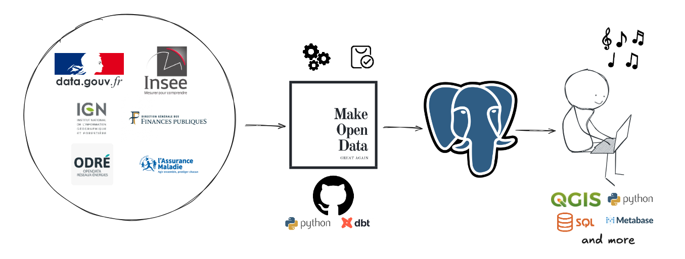
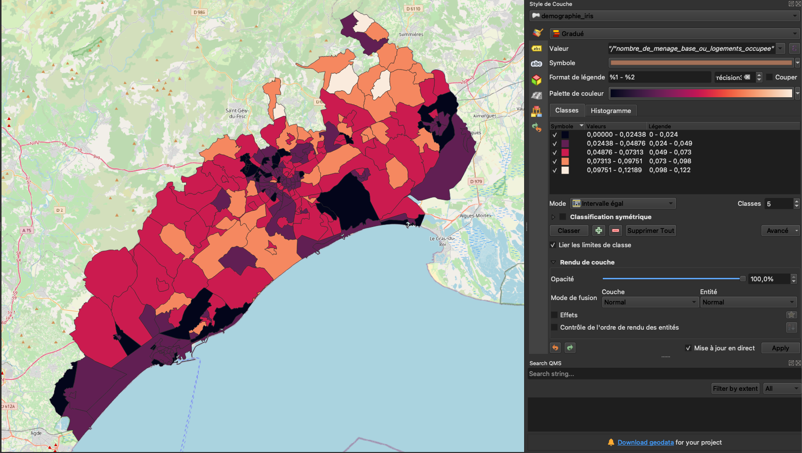

# Bienvenue sur Make Open Data.


### Des données publiques exploitables déployées sur une BDD Postgres/PostGIS accessibles depuis l'outil de votre choix.

- Présentation du projet ou contactez nous pour une démo : https://make-open-data.fr/ 
- Catalogue des données : https://data.make-open-data.fr/


Make Open Data est ELT Open Source pour données publiques :

- *Extrait* les fichiers sources (data.gouv, INSEE, Etalab, etc.) les plus adaptés et les récents ; 
- *Transforme* ces données selon des règles transparentes et le moins irréversibles possibles ;
- *Stocke* ces données dans une base de données PostgreSQL (avec PostGIS) ;
- *Teste* des présupposés sur ces données. Un prix par transaction immobilière sur DVF par exemple.




Données spatiales intégrables dans QGIS et autres SIG.




## Déploiement managé par Make Open Data

Nous fournissons les accès à une Postgres dans le cloud avec des données à jour.

Contactez-nous https://make-open-data.fr/ 


## Déploiement manuel

- Fourcher et cloner le repo (url dans l'onglet code SSH)

```
git clone git@github.com:<utilisateur_orga_destination>/<nom_repo_destination>.git
``` 
- Installer et activer un environnement virtuel


```
python3.11 -m venv dbt-env 
source dbt-env/bin/activate
pip install --upgrade pip
pip install -r requirements.txt
``` 

### PostgreSQL

Vous pouvez installer une instance PostgreSQL en local ou utiliser une instance existante.

Dans les deux cas, il est nécessaire d'exporter les clés de connexion pour accéder à l'instance PostgreSQL :

```
export POSTGRES_USER=<YOUR_POSTGRES_USER> # ex: postgres
export POSTGRES_PASSWORD=<YOUR_POSTGRES_PASSWORD>
export POSTGRES_HOST=<YOUR_POSTGRES_HOST> # ex: localhost
export POSTGRES_PORT=<YOUR_POSTGRES_PORT> # ex: 5432
export POSTGRES_DB=<YOUR_POSTGRES_DB> # ex: postgres
```

Optionnel : pour faciliter l'export de ces variables d'environnement plus tard :

* Créer un fichier `env.sh`
* Copier/coller ces commandes `export` dans le fichier
* Charger les variables d'environnement avec `. env.sh`

#### Option 1 - Installation d'une instance PostgreSQL en local

Prévoir 40 Go de disque et 4 Go de mémoire pour l'instance PostgreSQL.

Créer l'instance avec Docker Compose :

`docker-compose -f docker/docker-compose.yml up`

Accéder à l'interface d'administration via http://localhost:8080/.


#### Option 2 - Configuration d'instance PostgreSQL existante


- Installer PostGis :

```
psql postgresql://$POSTGRES_USER:$POSTGRES_PASSWORD@$POSTGRES_HOST:$POSTGRES_PORT/$POSTGRES_DB
CREATE EXTENSION postgis;  
```

### Chargement des données

- Extraire les données sources dans le schema `sources`:

```
python -m load # -> environ 5 min, uniquement un échantillon de données
python -m load --production # -> environ 20 min, toutes les données
```


- Connecter DBT à la base de données

```
export DBT_PROFILES_DIR=.  
dbt debug
dbt deps
``` 


- Réaliser et tester les transformations pour obtenir les tables finales

```
dbt seed
dbt run --target dev # environ 15 minutes -> tables logement sur région Occitanie et dvf sur Hérault. Utile pour tester rapidement. 
dbt run --target production # environ 1 heure
dbt test
``` 

- Les tables sources et préparées sont disponibles dans la BDD.
